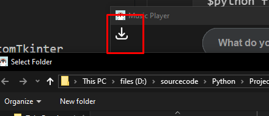
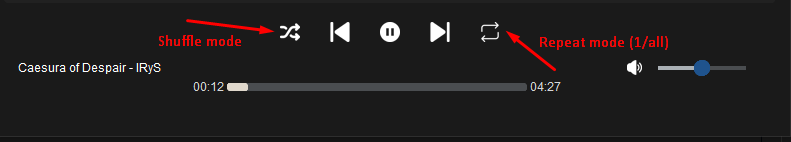

## About 

A portable music player app using CustomTkinter and MutagenMP3, still in development. This is just a demo product.
**DISCLAIMER: This product is still under development and is not the final version. It is also a small project for my Python class!**

---

### Step 1: Install the required libraries
```py
$pip install -r requirements.txt
```
This will install the required libraries, including CustomTkinter and MutagenMP3.
### Step 2: Run the app
```py
$python final.py
```
you can add the song manual via add song button at the top left corner


Shuffle & Repeat mode are also available in this app



**Available Key-binds**
- Esc to escape out of the search bar
- Space to pause/play song
